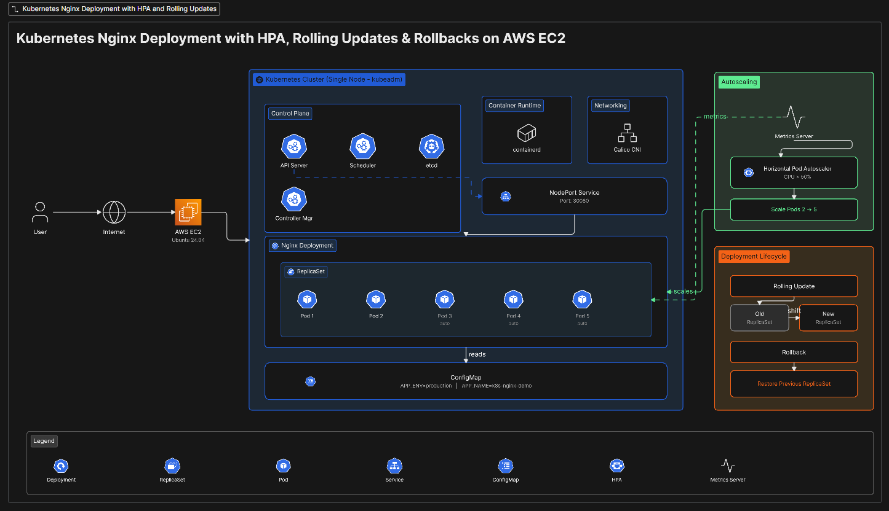
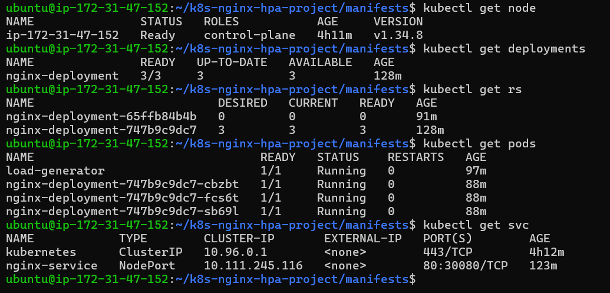
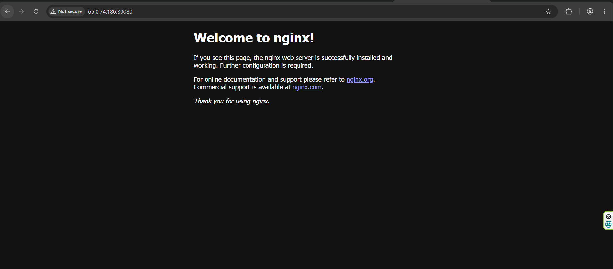
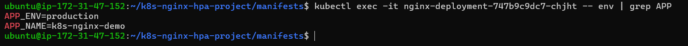
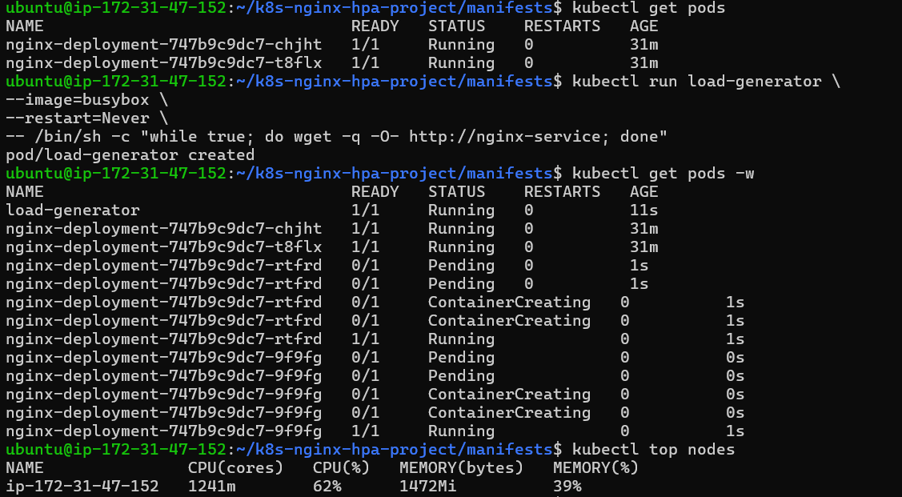
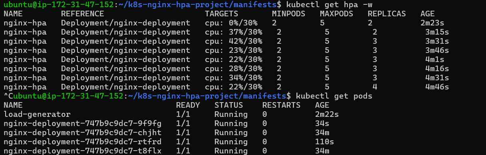
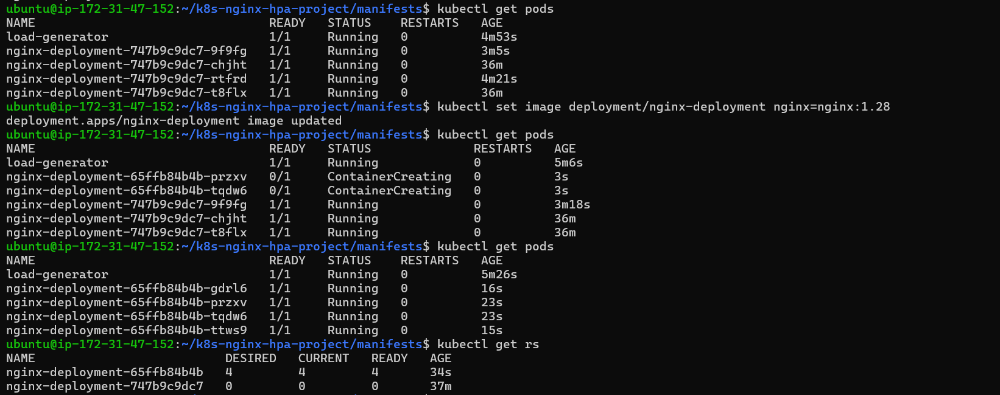
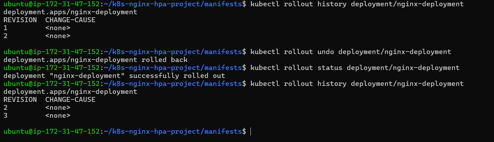

# Kubernetes Nginx Deployment with HPA

## Overview

This project demonstrates deploying and managing a containerized Nginx application on Kubernetes running on AWS EC2 using kubeadm.

The project covers core Kubernetes concepts including Deployments, ReplicaSets, Services, ConfigMaps, Horizontal Pod Autoscaling (HPA), Rolling Updates, and Rollbacks.

---

## Architecture



---

## Technologies Used

- AWS EC2
- Ubuntu Server
- Kubernetes (kubeadm)
- containerd
- Nginx
- Calico CNI
- Metrics Server
- Git & GitHub

---

## Features

- Kubernetes Deployment
- ReplicaSet Management
- NodePort Service Exposure
- ConfigMap Configuration Management
- Horizontal Pod Autoscaling (HPA)
- Resource Requests and Limits
- Rolling Updates
- Rollbacks
- CPU-based Scaling

---

## Project Structure

```text
k8s-nginx-hpa-project/

├── manifests/
│   ├── configmap.yaml
│   ├── deployment.yaml
│   ├── service.yaml
│   └── hpa.yaml
│
├── screenshots/
│
├── docs/
│
└── README.md
```

## Deployment Verification

### Deployments

```bash
kubectl get deployments
```

### Pods

```bash
kubectl get pods
```

### Services

```bash
kubectl get svc
```

### HPA

```bash
kubectl get hpa
```

---

## Autoscaling Test

A load generator was used to increase CPU utilization and verify automatic pod scaling through HPA.

Scaling Configuration:

- Minimum Pods: 2
- Maximum Pods: 5
- Target CPU Utilization: 30%

---

## Rolling Updates

Application updates were deployed using Kubernetes rolling update strategy to ensure zero downtime.

Example:

```bash
kubectl set image deployment/nginx-deployment nginx=nginx:1.28
```

---

## Rollbacks

Rollback testing was performed to restore a previous stable version.

Example:

```bash
kubectl rollout undo deployment/nginx-deployment
```

---

## Screenshots

### Kubernetes Cluster Overview

Node, Deployment, ReplicaSet, Pods and Service status.



---

### Application Access

Nginx application exposed through Kubernetes NodePort Service.



---

### ConfigMap Verification

ConfigMap values injected into running containers as environment variables.



---

### Horizontal Pod Autoscaler - Load Generation

BusyBox load generator continuously sends requests to the Nginx service to increase CPU utilization.



---

### Horizontal Pod Autoscaler - Scaling Result

Deployment automatically scaled from 2 replicas to 4 replicas after CPU utilization exceeded the configured threshold.



---

### Rolling Update

Application image updated using Kubernetes rolling deployment strategy with zero downtime.



---

### Rollback

Deployment successfully rolled back to the previous stable revision.


---

## Key Learnings

- Kubernetes Deployment lifecycle management
- ReplicaSet behavior
- Service networking
- ConfigMap usage
- Resource management
- Horizontal Pod Autoscaling
- Rolling Update strategy
- Rollback procedures
- Kubernetes administration using kubeadm

---

## Future Enhancements

- Ingress Controller
- Helm Charts
- Prometheus Monitoring
- Grafana Dashboards
- ArgoCD GitOps
- CI/CD using GitHub Actions
